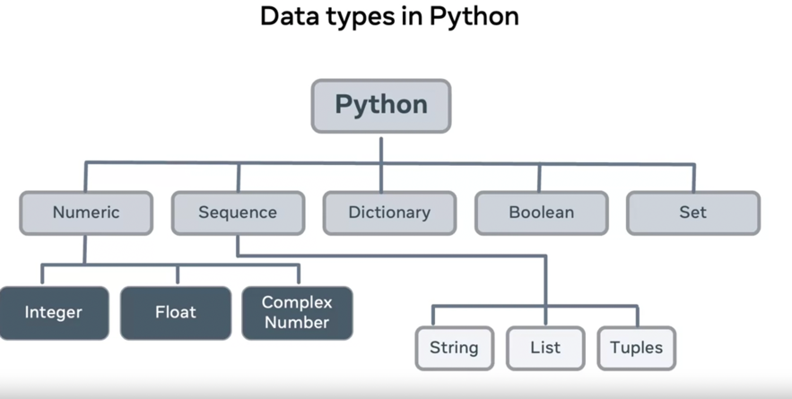

### Notes 

##### Variables

- a=b=c=10 this also works
- a,b,c = 1,2,3 results to a=1 then b=2, and c=3 , this assignment also works
- del a; means we can use del operator for deletion

##### Datatypes



#### Python converting the code to machine understandable code
Python code -> Encoding Unicode -> Binary Code

- multi line code can be done by adding / at the end of a line

##### Type Conversion

- Implicit
  - only happens between datatypes that are compatible, for example float to int can be done, but string to int cant.

- Explicit
  - str(), int(), float()  
  - ord(), hex(), oct() , tuple(), set(), list(), dict()

* Input function
  * some special keywords are there that can be passed as a second argument with print
  * object - values
  * sep - how the objects are sperated
  * end - what is printed at the end
  * file - to specify where the output should be printed to by default stdout
  * flush - to move data from the temporary storage to a permanent storage
  * ex:
    * print("Hello", "you!", sep=", ") -> Hello, you!
    * output formatting
      * print("I like {0} more than {1}.format("oranges", "grapes")) -> I like oranges more than grapes


##### Scopes

_(1->4 , inner-layer -> outer-layer)_

1. Local Scope
2. Enclosing Scope
3. Global Scope
4. Built-in Scope


* example 
```python
#Built in scope()def
def outer():
    #Enclosed Scope
    b = 2
    def inner():
        # Local scope
        c = 3
```

